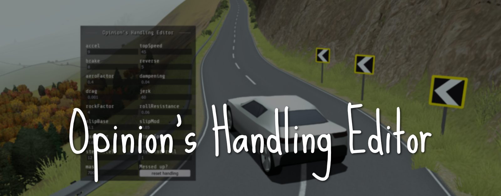
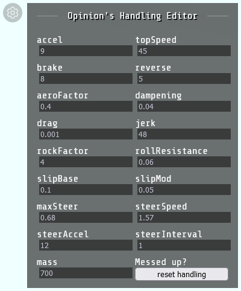

Opinion's Handling Editor is a mod for slowroads.io which gives you access to a simple handling editor. Get more out of your vehicle by customizing it on the fly.

Supports slowroads.io on version 1.0.1.

## How it works
 - You install a *userscript* in Tampermonkey or Violentmonkey (Greasemonkey not supported yet) (other similar extensions not tested).
 - The *userscript* will block the original *game script* and replace it with a slightly modified version.
   - The modified *game script* exposes some variables related to the game's state. This allows us to modify these settings on the fly.
   - The *userscript* also adds an in-game menu for the handling editor.

## Installation instructions
### 1. Installing Firefox
Go to https://www.mozilla.org/en-US/firefox/new/.  
Download and install the latest version of Firefox.

> Chromium based browsers not tested. We rely on a Javascript event 'beforescriptexecute' which is only supported by Firefox  
> See https://developer.mozilla.org/en-US/docs/Web/API/Element/beforescriptexecute_event

### 2. Installing Tampermonkey
Open Firefox and install the Tampermonkey extension from https://addons.mozilla.org/en-US/firefox/addon/tampermonkey/.

Optionally you can choose one of these alternatives:
 - Violentmonkey: https://addons.mozilla.org/en-US/firefox/addon/violentmonkey/.
 - Greasemonkey not supported yet (see [issue #1](https://github.com/Opinion/slowroads-handling-editor/issues/1)).

### 3. Installing userscript
With Tampermonkey installed, click the extension button (top right) and select **"Create new script..."**.
A new window will pop up. This is the userscript editor. For now, select **all** existing text and remove it.

In a new tab, go to [repo/version/1.0.1/userscript.tampermonkey.js](version/1.0.1/userscript.tampermonkey.js) and copy the userscript.

Go back to Tampermoney's userscript editor and paste the copied userscript.

Press `CTRL+S` in the userscript editor to save or select `File > Save` from the context menu. You will see a popup on the top of the screen saying "Operation completed successfully".

You can now close the tab for the userscript editor.

### 4. Enjoy
Go to https://slowroads.io and enjoy the handling editor.

> **Be careful! Some values can cause the game to crash.**

> **If the game starts lagging after a crash, you may need to open the game in a new tab. Reloading the page isn't enough sometimes.**  
> In my case, I could identify when this was happening by listening for missing game sounds (i.e. motor, rolling tires, skids and crash).

> Values are changed by listening to the 'change' event.  
> For best results, click anywhere inside the game after editing a value in the handling editor.

> Placed the handling editor outside the viewport of your browser? Reload the game page to get the window back.

## Preview

## Upcoming changes
 - Make this mod a browser extension instead of a userscript
   - **Q:** Possible? | **A:** Very much so.
   - **Q:** Firefox and Chromium browser support? | **A:** Ohh yes.
   - **Q:** When? | **A:** Just hold on, I'm working on it.
 - Find more handling related parameters and make them configurable
   - Change individual wheel settings from the handling editor
   - Change drive mode from the handling editor (awd, fwd, rwd) (want this before I make savable presets)
   - Change vehicle from the handling editor (car, bus, bike) (want this before I make savable presets)
 - Add savable presets
   - Option to change to a different preset while reversing (use selected preset by default)
   - Option to change to a different preset while holding handbrake (use selected preset by default)
   - If both reversing and using handbrake, choose which should overrule the other
   - **Q:** Why? | **A:** I believe this can churn out some amazing drift handlings. Like allowing the car to spin out the rear easier when holding down the handbrake.
 - Add some default presets
   - Need to do some playtesting and try to make some good handlings.
 - Add a selection of car "skins" (retexture)

## Things I need to figure out
 - Can road/dirt/grass be configured in any way?
 - Take a look at the code and learn more about how the handling works in slowroads.io
 - Other settings related to handling?
 - Can we modify the time-of-day?
 - Can we replace textures (not a huge fan of the default white car)?
